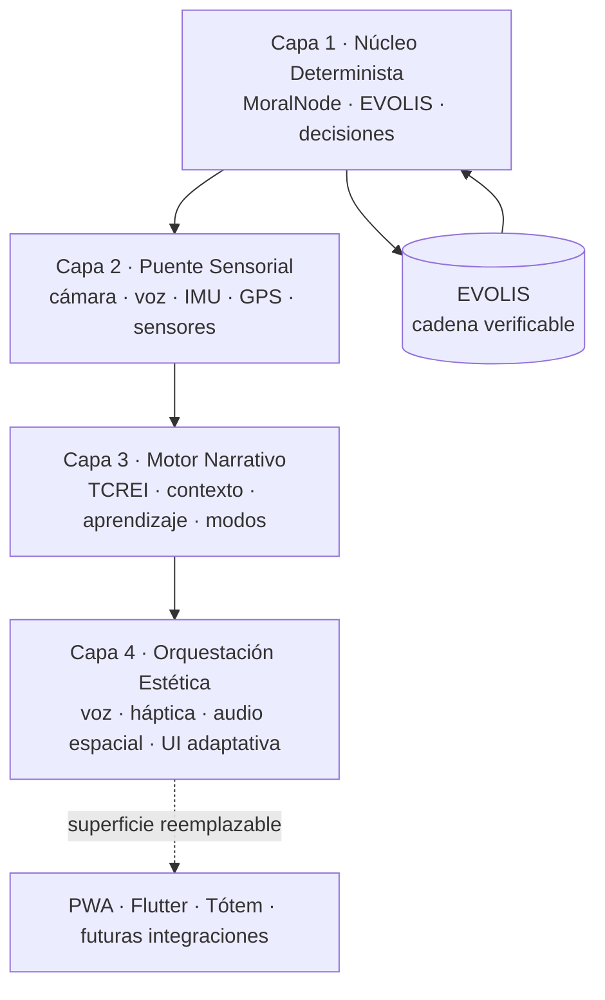
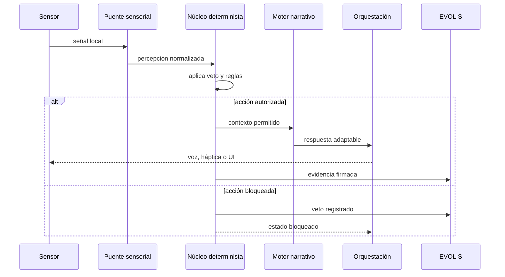

<div align="center">

# 🧠 Sentra Core

**Motor de IA Soberano · Offline-First · Veto Humano Determinista · Trazabilidad Inalterable**

[](https://github.com/matylipsa-create/Sentra-Core-Vision/actions/workflows/build-pwa.yml)
[](https://opensource.org/licenses/MIT)
[](https://www.typescriptlang.org/)
[](https://reactjs.org/)
[](https://web.dev/progressive-web-apps/)

> _"Cuando todo lo demás se apaga, Sentra Core sigue ahí."_

</div>

---

## 🎯 ¿Qué es Sentra Core?

Sentra Core es un **motor de IA soberano** que funciona **completamente offline**, con **veto humano determinista** y **trazabilidad inalterable**. No es una app. Es una **plataforma**.

**1 motor. 1 botón. N mercados.**

- 🦯 **Accesibilidad:** Sentra Vision, asistencia visual para personas ciegas
- 🛡️ **Ciberseguridad:** Sentinel, defensa autónoma y verificable
- 🎮 **Gaming:** ZION, narrativa adaptativa
- 🏠 **Domótica:** ZION Home, control soberano sin nube
- 🧘 **Bienestar:** BioSoftware, protocolos de coherencia y foco
- 📡 **Hardware:** Tótem 2.0, nodos ESP32 y comunicación LoRa

La UI puede cambiar. El motor permanece: percibe, evalúa, decide, registra y se adapta bajo reglas explícitas.

## 🏗️ Arquitectura: 4 capas



| Capa | Responsabilidad | Estado |
| --- | --- | --- |
| **1. Núcleo Determinista** | Veto humano, reglas éticas, decisiones y evidencia criptográfica | ✅ Operativa |
| **2. Puente Sensorial** | Percepción local, normalización y conexión con dispositivos | ✅ Operativa |
| **3. Motor Narrativo** | Contexto, inclinaciones, TCREI, aprendizaje y modos | ✅ Operativa |
| **4. Orquestación Estética** | Audio dinámico, voz, háptica y adaptación de interfaz | 🟡 Parcial · audio dinámico Q1 2027 |

> **Regla de diseño:** la experiencia visual no decide por el motor. Solo expresa su estado y sus decisiones autorizadas.

## ⚙️ 28 features implementadas

### Núcleo soberano

- ✅ MoralNode con veto humano y reglas de privacidad, violencia y operación offline
- ✅ EVOLIS con hash chain SHA-256, firmas ECDSA P-256 y verificación de integridad
- ✅ Historial de decisiones e inclinación con confianza escalada por volumen de muestra
- ✅ Nodos de inflexión y reversión de estados
- ✅ Persistencia local, exportación e importación de evidencia
- ✅ Gestión de dispositivos y ajuste automático de capacidades
- ✅ Guardian USB y monitoreo de integridad
- ✅ Sincronización preparada para redes P2P y LoRa
- ✅ Lógica ternaria para confianza y estados de seguridad

### Percepción y accesibilidad

- ✅ Cámara y detección local con COCO-SSD
- ✅ OCR offline con Tesseract.js
- ✅ Descripción contextual en español y traducción de clases
- ✅ Debounce de detecciones para evitar repetición
- ✅ Feedback háptico por distancia
- ✅ Audio espacial binaural
- ✅ TTS configurable a 1x, 1.5x y 2x
- ✅ Onboarding por voz
- ✅ ARIA y navegación compatible con TalkBack, VoiceOver y NVDA

### Motor adaptativo

- ✅ Modos smooth, analytical y silent
- ✅ Perfil de inclinación del usuario
- ✅ Sugerencias accionables registradas en EVOLIS
- ✅ Percepción de habilidades y patrones de uso
- ✅ Gestión de carga cognitiva
- ✅ Descomposición de tareas
- ✅ Registro de campo
- ✅ Orquestación de eventos y failover
- ✅ Paneles de visión, sensores, modelos, LoRa y guardian
- ✅ Service Worker y experiencia PWA offline-first

## 🔁 Cómo fluye una decisión



## 📦 Superficies de despliegue

| Superficie | Uso | Tecnología |
| --- | --- | --- |
| **Sentra Vision** | Asistencia visual y accesibilidad | React + TypeScript + PWA |
| **Flutter** | Cliente móvil nativo y expansión multiplataforma | Dart + Flutter |
| **Servidor** | API, WebSocket y protocolo TCREI | Node.js + TypeScript |
| **Tótem 2.0** | Sensores distribuidos y operación de campo | ESP32 + LoRa + C++ |

## 🚀 Inicio rápido

```bash
npm install
npm run dev
```

Para verificar el motor:

```bash
npm run typecheck
npm run build
```

La PWA puede instalarse en desktop o móvil y mantiene la percepción principal en el dispositivo. La conectividad amplía el sistema; no es un requisito para su núcleo.

## 📊 Estado del activo

- **28 features** implementadas
- **1363+ módulos** procesados por el build
- **0 errores TypeScript** en el build de referencia
- **4 capas** de arquitectura
- **Offline-first** como requisito de diseño
- **Capa 4 parcial:** audio dinámico planificado para Q1 2027

## 🧭 Roadmap

### Q4 2026

- Piloto de Sentra Vision con usuarios reales de UMADESCA
- APK Flutter nativo con TalkBack
- Cola de sincronización IndexedDB
- Demo institucional para ATICMA y Endeavor

### Q1 2027

- Tótem 2.0 con ESP32-S3 y red LoRa mesh
- Audio espacial avanzado con HRTF
- OCR con ML Kit
- Evolución de la capa de Orquestación Estética

### 2027+

- Nuevas verticales sobre el mismo motor
- Integraciones con redes privadas, emergencias y despliegues de campo
- Evolución de la evidencia hacia criptografía post-cuántica

## 📚 Documentación

- [Arquitectura completa](ARCHITECTURE.md)
- [Mapa visual del sistema](docs/visual/README.md)
- [Sentra Vision](docs/README_VISION.md)
- [Decisiones de auditoría](docs/AUDIT_DECISIONS.md)
- [Arquitectura multimodal](docs/MULTIMODAL_INTERFACE_ARCHITECTURE.md)
- [Tótem 2.0](docs/HARDWARE_TOTEM_2.0.md)
- [Guion de demo](docs/DEMO_SCRIPT.md)
- [Pitch UMADESCA](docs/PITCH_UMADESCA.md)

## 🤝 Ecosistema y modelo

Sentra Core se plantea como un **Open Core**: el motor y sus principios deben poder auditarse, mientras que las verticales, integraciones y hardware habilitan modelos B2B, B2G y de impacto social.

El objetivo no es agregar complejidad visible. Es ofrecer un núcleo confiable que distintas organizaciones puedan adaptar sin perder soberanía del dato, control humano ni trazabilidad.

## 📄 Licencia

Distribuido bajo licencia MIT. Ver [LICENSE](LICENSE) si está presente en la distribución.

---

<div align="center">

**Sentra Core: soberanía tecnológica aplicada a decisiones reales.**

</div>
