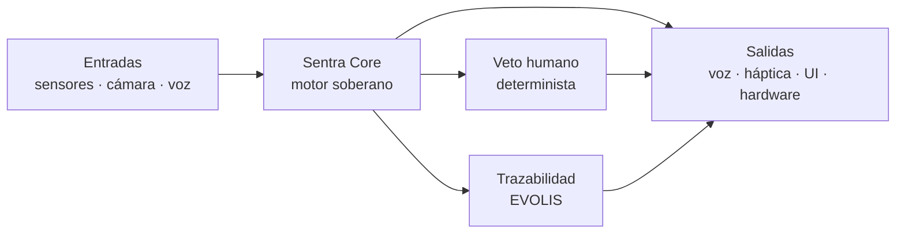
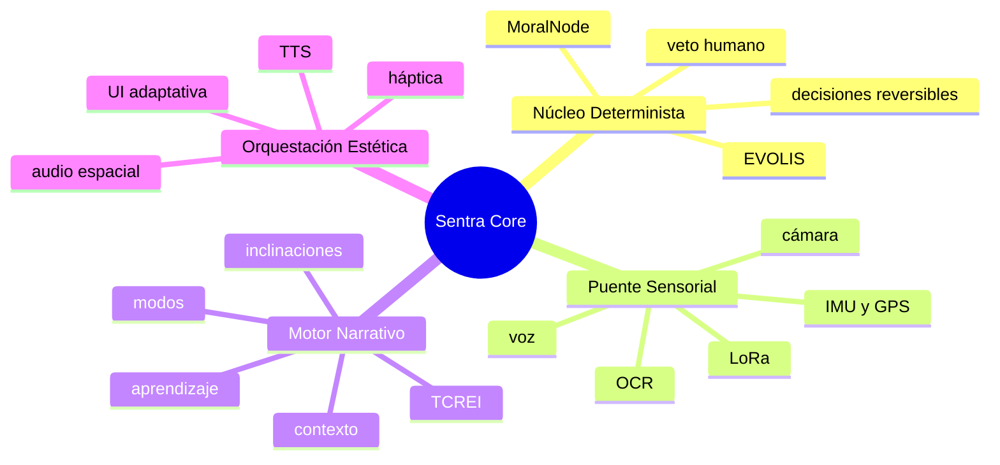
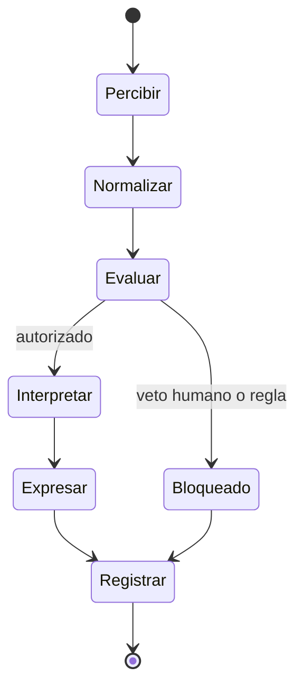
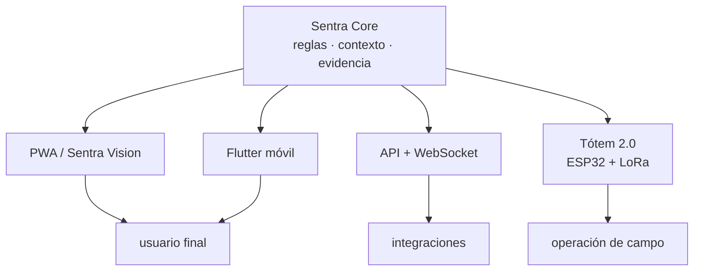

# Sentra Core · Mapa visual

Esta carpeta reúne diagramas de lectura rápida para presentar el activo técnico a equipos de producto, aliados institucionales y potenciales integradores.

## La tesis en una imagen

**El motor es el activo. La interfaz es un botón.** La misma lógica puede expresarse en una PWA, una app Flutter, un backend o un Tótem de campo.

## Las cuatro capas

## De una señal a una respuesta

## Portabilidad del núcleo

## Lectura para una demo

1. **Percepción:** una señal entra desde cámara, voz o sensor.
2. **Control:** el Núcleo Determinista evalúa reglas y veto humano.
3. **Contexto:** el Motor Narrativo decide cómo traducir la señal.
4. **Experiencia:** la Orquestación expresa el resultado con la menor carga posible.
5. **Evidencia:** EVOLIS deja una entrada verificable, tanto si la acción fue permitida como bloqueada.

## Documentos relacionados

- [README principal](../../README.md)
- [Arquitectura detallada](../../ARCHITECTURE.md)
- [Arquitectura multimodal](../MULTIMODAL_INTERFACE_ARCHITECTURE.md)
- [Protocolo LoRa](../LORA_PROTOCOL_ARCHITECTURE.md)
- [Arquitectura cuantizada](../QUANTIZED_AI_ARCHITECTURE.md)
